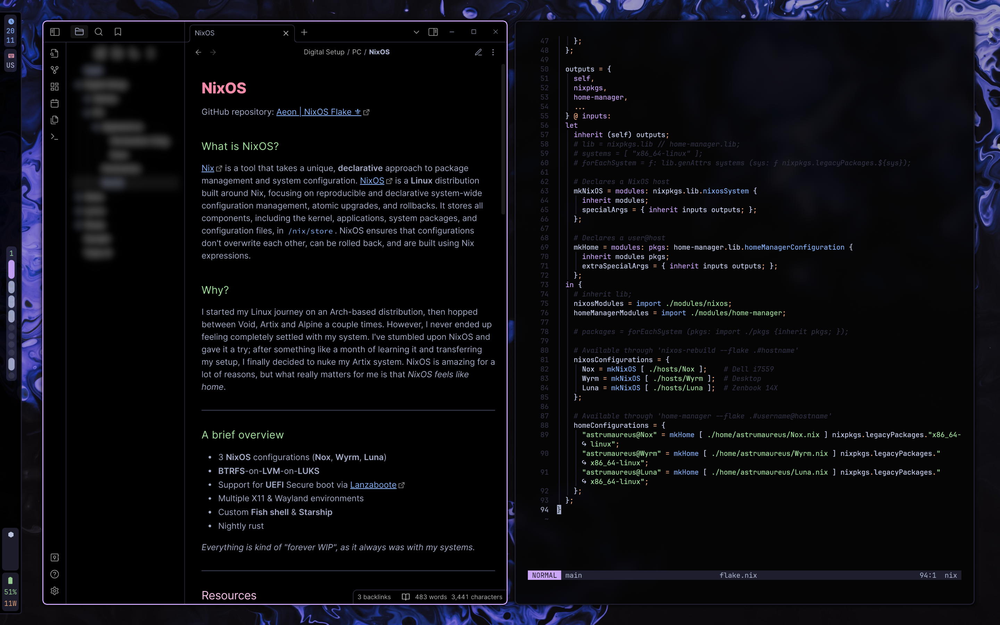

### Aeon | NixOS Flake ⚜️
After some time driving **Void**, **Artix** & **Alpine**, I've decided to try **NixOS**. This repo will house my progress in learning Nix & migrating my setup. Here's a desktop screenshot as of september '23:

