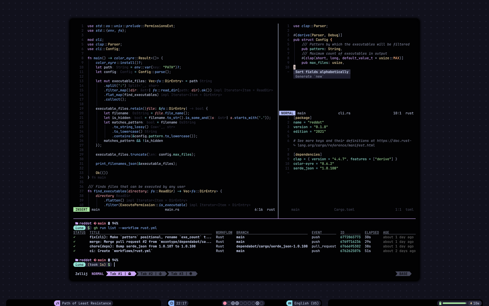

### Aeon | NixOS Flake ⚜️

#### What is NixOS?
[Nix](https://nixos.org/) is a tool that takes a unique, **declarative** approach to package management and system configuration. [NixOS](https://nixos.org/) is a **Linux** distribution built around Nix, focusing on reproducible and declarative system-wide configuration management, atomic upgrades, and rollbacks. It stores all components, including the kernel, applications, system packages, and configuration files, in `/nix/store`. NixOS ensures that configurations don't overwrite each other, can be rolled back, and are built using Nix expressions.

#### Why?
I started my Linux journey on an Arch-based distribution, then hopped between Void, Artix and Alpine a couple times. However, I never ended up feeling completely settled with my system. I've stumbled upon NixOS and gave it a try; after something like a month of learning it and transferring my setup, I finally decided to nuke my Artix system. NixOS is amazing for a lot of reasons, but what really matters for me is that *NixOS* *feels like home*.

> [!IMPORTANT]
> This flake contains my *personal* NixOS and Home-manager configurations, which are tied to concere partition `UUID`s, SSH and Age public keys, user passwords and others things that are unique by their nature. This means installing configuration outputs of this flake on foreign systems would require as least ripping out all of the `sops-nix` stuff and defining a new `host`.

---

### A brief overview
- Multiple **NixOS** configurations (**Nox**, **Wyrm**, **Luna**)
- **BTRFS**-on-**LVM**-on-**LUKS**
- Support for **UEFI** Secure boot via [Lanzaboote](https://github.com/nix-community/lanzaboote)
- Rich **Wayland** environment

*Everything is kind of "forever WIP", as it always was with my systems.*

---

### Hosts

#### *Luna*
2023' **ASUS Zenbook 14X** with an **i9-13900H**, **RTX 3050** and **32**Gb RAM. My favorite and the current daily driver.

#### *Wyrm*
A desktop with an **i7-8700K**, **GTX 1080** and **16**Gb RAM. Was my main worker before **Luna**.

#### *Nox*
15.6" **Dell i7559**, the one that started everything and hosted the growth of this configuration.

---

### Resources
- [NixOS Wiki](https://nixos.wiki)
- Misterio77's [nix-config](https://github.com/Misterio77/nix-config)
- [MyNixOS](https://mynixos.com)
